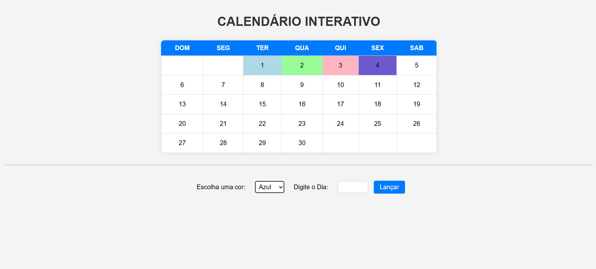

# Calendário Interativo

## Descrição do projeto

Projeto de um calendário do mês de Abril de 2025 utilizando HTML, CSS e Java Script.

## Caléndario

## Funções adicionadas 

- Função de escolher uma cor para preencher o dia;
- Escolha do dia a ser preenchido pela cor escolhida.

## HTML

Utilizado para a estruturação do calendário.

## CSS

Utilizado para a estilização do calendário.

## Java Script

Utilizado para atribuir as funções como a escolha e validação da cor escolhida pelo usuário, o dia escolhido validando para que seja do 1° dia do mês ao 30° dia, e um botão para lançar as escolhas do usuário.

### Linguagens de programação

``HTML5``  
``CSS3``  
``Java Script``

# Autores

[ Guilherme Henrique Silva](https://github.com/Guilherme-Henr-Silva)